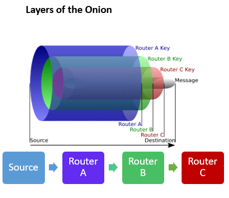
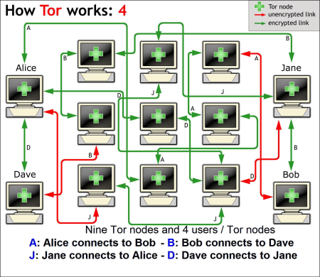

<h1 align="center"> protector </>

<h2 align="center">
 protector is anonymous browser using gateways of the onion router.
</h2>

  

   

<h3> Easy Install </h3> 
Open a terminal with root permissions and run this command:   
bash <(curl -s https://raw.githubusercontent.com/makdosx/protector/main/install.txt)     

<h4>  Notice  for protector browser. </h4> 
For go to any address press enter.   
For open new tab press double left click. </h4>     

<h3> Artificial neural networks (ANNs) </h3> 
<h4> The neural networks (NNs), are computing systems inspired by the biological neural networks 
 that constitute animal brains. </h4>
 
 

  

  

  

  

 
 <h4> One of the most famous neural network (NNs) is The onion router. </h4>
 
 

  

  

